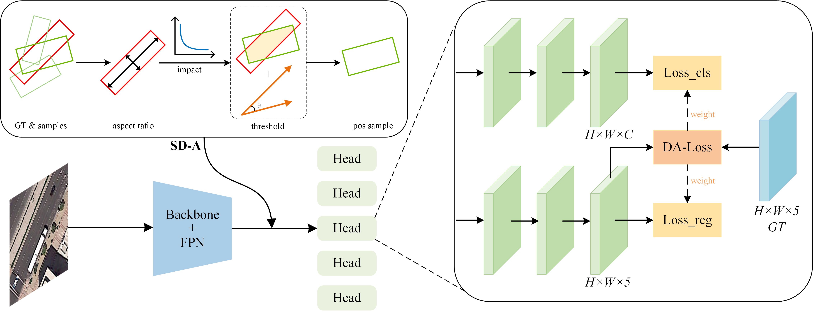

# SDDLA
### Title:Shape-Dependent Dynamic Label Assignment for Oriented Remote Sensing Object Detection

 

## Results
|Model          |    Backbone     |    MS  |   mAP| Download|
|:-------------:| :-------------: | :-----:| :-----: | :-----:  | :------------: | :----: | :---------------------------------------------------------------------------------------: |
|DARDet         |    R-50-FPN     |   -    |  77.61 | [cfg](configs/DARDet/dardet_r50_fpn_1x_dcn_test.py)[model](https://pan.baidu.com/s/1aspypaz8a7QvFyUdDR986g)    |
|DARDet         |    R-50-FPN     |   -    |  78.74 |  [cfg](configs/DARDet/dardet_r50_fpn_1x_dcn_rotate_test.py)[model](https://pan.baidu.com/s/1VPsAB3Kb90IqJTluH6lFHw)     |

## Preparations
Note: mmcv>=1.3.17, <=1.8.0
- Linux
- Python 3.7
- PyTorch 1.12
- cudatoolkit:11.6
- mmrotate:0.3.4
